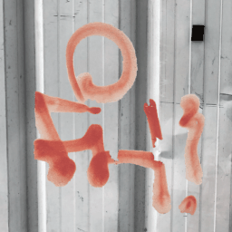
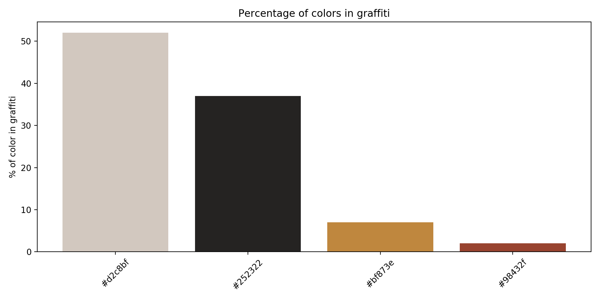
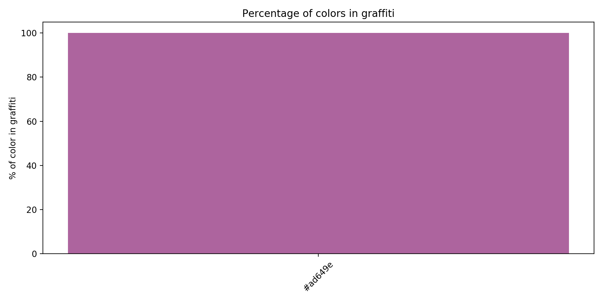

# Graffiti Dataset Toolbox

This is toolbox I use to work with my graffiti dataset.

## Graffiti dataset

In this repository are few samples of this dataset to better explain its functionality.

<table>

<tr>
<td>
Source Image
</td>
<td>
Graffiti Mask
</td>
<td>
Background mask
</td>
<td>
Background graffiti
</td>
<td>
Incomplete Graffiti
</td>
<td>
Tool used
</td>
<td>
Number of colors
</td>
</tr>

<tr>
<td>
    
</td>
<td>
    
</td>
<td>
    
</td>
<td>
    
</td>
<td>
    
</td>
<td>
	Spray paint
</td>
<td>
	Many
</td>
</tr>

<tr>
<td>
    
</td>
<td>
    
</td>
<td>
    
</td>
<td>
    
</td>
<td>
    
</td>
<td>
	Spray paint
</td>
<td>
	One
</td>
</tr>

<tr>
<td>
    
</td>
<td>
    
</td>
<td>
    
</td>
<td>
    
</td>
<td>
    
</td>
<td>
	Spray paint
</td>
<td>
	One
</td>
</tr>

<tr>
<td>
    
</td>
<td>
    
</td>
<td>
    
</td>
<td>
    
</td>
<td>
    
</td>
<td>
	Spray paint
</td>
<td>
	One
</td>
</tr>

<tr>
<td>
    
</td>
<td>
    
</td>
<td>
    
</td>
<td>
    
</td>
<td>
    
</td>
<td>
	Spray paint
</td>
<td>
	One
</td>
</tr>

</table>

All samples have following attributes

* `Readable text` - If graffiti contains some readable text
* `Tool used` - Tool used to draw the piece, currenty this is can be `marker` or `spray_paint`
* `Number of colors used` - `0` if more than one color is used, `1` othervise
* `GPS coordinates` - GPS coordinates extracted from EXIF data
* `Graffiti Type` - `tag` or `graffiti`

All samples have following masks

* `Graffiti Mask` - Mask defining main graffiti in the image
* `Background mask` - Mask defining background. This shouldn't contain any graffiti pixels
* `Background graffiti` - Samples sometimes contain graffiti other than the main one. This mask define those
* `Incomplete Graffiti` - This can define parts with missing or damaged areas of graffiti.

## Data augmentation

This toolbox implements few augmentations which can be applied to dataset samples

### Elastic transformation

<table>
<tr>
<td>

</td>

<td>

</td>
</tr>

<tr>
<td>
Source Image
</td>
<td>
Transformed image
</td>
</tr>
	
</table>

### Modified colors

<table>
<tr>
<td>

</td>

<td>

</td>
</tr>

<tr>
<td>
Source Image
</td>
<td>
Modified image
</td>
</tr>
	
</table>

### Modified colors + Elastic transformation

<table>
<tr>
<td>

</td>

<td>

</td>
</tr>

<tr>
<td>
Source Image
</td>
<td>
Transformed image
</td>
</tr>
	
</table>

### Random background

<table>
<tr>
<td>

</td>

<td>

</td>
</tr>

<tr>
<td>
Source Image
</td>
<td>
Graffiti on random background
</td>
</tr>
</table>

### Random background + Random color

<table>
<tr>
<td>

</td>

<td>

</td>
</tr>

<tr>
<td>
Source Image
</td>
<td>
Transformed image
</td>
</tr>
	
</table>

### All transformations

<table>
<tr>
<td>

</td>

<td>

</td>
</tr>

<tr>
<td>
Source Image
</td>
<td>
Transformed image
</td>
</tr>
	
</table>

## Features

Samples have multiple features attached to it

### Graffiti colors

The most common colors in the graffiti

<table>

<tr>
<td>
Source Image
</td>
<td>
RGB Kmeans clusters
</td>
<td>
HSV DBSCAN clusters
</td>
</tr>

<tr>
<td>
    
</td>
<td>
    
</td>
<td>
    
</td>
</tr>

<tr>
<td>
    
</td>
<td>
    
</td>
<td>
    
</td>
</tr>

<tr>
<td>
    
</td>
<td>
    
</td>
<td>
    
</td>
</tr>

<tr>
<td>
    
</td>
<td>
    
</td>
<td>
    
</td>
</tr>

<tr>
<td>
    
</td>
<td>
    
</td>
<td>
    
</td>
</tr>

</table>

```python
from graffiti_dataset.dataset import DatasetSample
from graffiti_dataset.tools import draw_main_colors

sample = DatasetSample('./dataset/graffiti_sample/8703f3c389a1f73f.p')

sample_main_colors = sample.main_colors()

draw_main_colors(sample_main_colors, 'colors.png')

```

### GPS coordinates

GPS coordinates obtained from EXIF

Locations of samples in this repository :


How to generate such map

```python
import glob
from graffiti_dataset.tools import draw_map

dataset_samples = glob.glob('./dataset/graffiti_sample/*.p')

draw_map(dataset_samples, f'./readme_images/map.html')
```

### Color analysis

3D cube representing colors in sample can be made with `tools.draw_color_cube(sample, 'pixels.html')`


Colors represented as HSV can be desplayed with `tools.draw_hsv_pixels(sample, 'out.png')`


## Process data from LabelBox

```
python3 labelbox_to_pickle.py export.csv dataset/graffiti dataset.csv
```

* `export.csv` - CSV file exported from LabelBox
* `dataset/graffiti` - Directory where processed samples should be stored
* `dataset.csv` - CSV file made when files were preprocessed before uploading to LabelBox. We need to do this in order to save GPS coordinates


